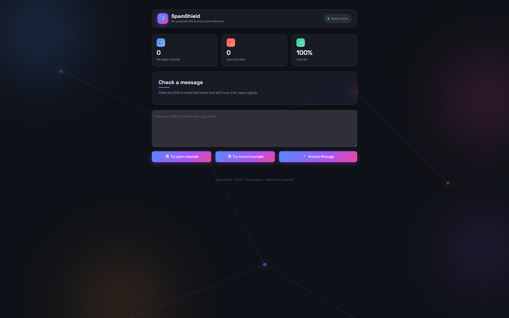

# 🛡️ SpamShield — SMS & Email Spam Detector

A machine learning web app that classifies SMS and email messages as **spam** or **safe** in real time, wrapped in a dark glassmorphic dashboard UI built with Streamlit.



---

## ✨ Features

- **Real-time classification** — paste any SMS or email text and get an instant spam/safe verdict
- **Confidence scoring** — see the model's probability estimate with an animated gradient bar
- **Random sample messages** — one-click buttons load a random spam or normal example from a curated pool
- **Session dashboard** — live stats for messages checked, spam blocked, and safe rate
- **Recent checks history** — the last 5 analyzed messages with color-coded verdicts
- **Dark glassmorphic UI** — frosted glass cards, animated gradient background, hover effects, and smooth CSS-driven transitions (no page reload flicker)

---

## 📸 Screenshots

| Message input | Safe result |
|---|---|
|  |  |

| Spam detected |
|---|
|  |

---

## 🧠 How it works

1. **Preprocessing** — input text is lowercased, tokenized (NLTK), stripped of punctuation and stopwords, and stemmed (Porter Stemmer).
2. **Vectorization** — the cleaned text is transformed into TF-IDF features using a pre-fit `TfidfVectorizer`.
3. **Classification** — a `MultinomialNB` (Naive Bayes) model predicts spam vs. safe and returns a probability score.
4. **Result rendering** — the verdict, confidence, and animated UI feedback are rendered based on the prediction.

---

## 🛠️ Tech Stack

| Layer | Tools |
|---|---|
| UI | Streamlit + custom CSS (glassmorphism, keyframe animations) |
| NLP preprocessing | NLTK (tokenization, stopwords, stemming) |
| Feature extraction | scikit-learn `TfidfVectorizer` |
| Model | scikit-learn `MultinomialNB` |
| Language | Python 3 |

---

## 📂 Project Structure

```
spam-detector/
├── app.py              # Streamlit app (UI + inference logic)
├── model.pkl            # Trained MultinomialNB model
├── vectorizer.pkl        # Fitted TF-IDF vectorizer
├── sms_spam_detector.ipynb  # Notebook: data cleaning, EDA, training
├── spam.csv             # Training dataset (SMS Spam Collection)
└── screenshots/          # UI screenshots used in this README
```

---

## 🚀 Getting Started

### 1. Clone the repo
```bash
git clone https://github.com/<your-username>/spam-detector.git
cd spam-detector
```

### 2. Install dependencies
```bash
pip install streamlit scikit-learn nltk
```

### 3. Run the app
```bash
streamlit run app.py
```

NLTK's `punkt`, `punkt_tab`, and `stopwords` datasets download automatically on first run.

The app will be live at `http://localhost:8501`.

---

## 📊 Dataset

Trained on the [SMS Spam Collection Dataset](https://archive.ics.uci.edu/dataset/228/sms+spam+collection), a public set of 5,500+ labeled SMS messages.

---

## 📄 License

This project is open source and available under the [MIT License](LICENSE).

---

## 🙋 Author

Built by Harsh as a portfolio project demonstrating end-to-end ML deployment — from text preprocessing and model training to a polished, interactive front end.
